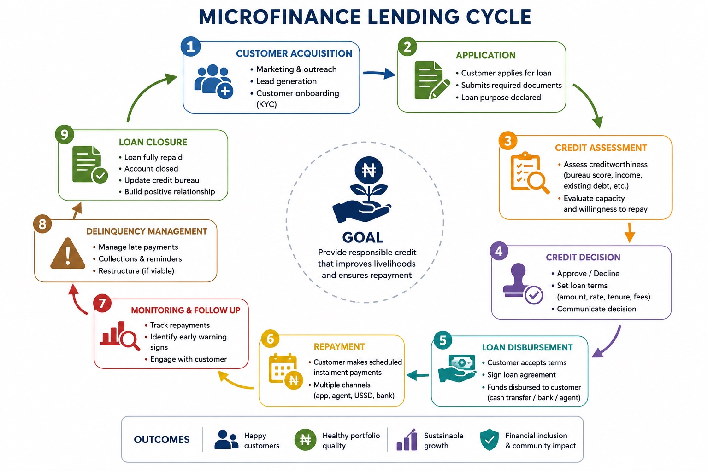

## Credit Risk Analysis at Cedar MFB — Week 1

## Understanding the Lending Lifecycle and Building the Data Foundation
# Introduction

As part of my journey into credit-risk analysis, I am taking on a simulated role as a Junior Credit-Risk Analyst at Cedar MFB, a fictional Nigerian microfinance bank.

My first assignment was not to calculate complicated credit-risk metrics. Instead, the objective was to understand the business process behind lending and the data generated throughout that process.

Before a credit-risk analyst can calculate delinquency, arrears or portfolio risk, they need to understand where the data comes from, how the different datasets are connected, and what each field represents.

Therefore, Week 1 focused on building the foundation for a credit-risk analysis project.
The central question I explored was:

How does a loan move from application to final repayment or write-off, and what data is produced at each stage?

To answer this, I studied the lending lifecycle, created a data dictionary, built a small synthetic lending dataset in Excel, identified credit-risk questions that could be answered from the data, and performed basic data-quality checks.
## The Cedar MFB Lending Lifecycle
A loan does not simply appear in the system as a loan. It passes through several stages. Understanding the different stages in the lifecycle is important because each stage produces different data.

#### Image of a Lending lifecycle
